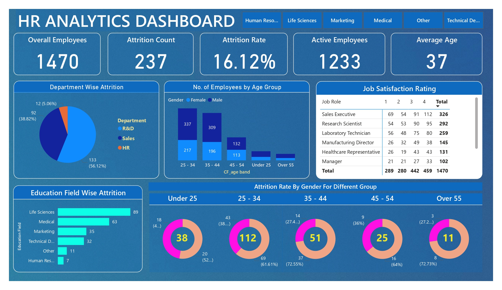

# HR Analytics Dashboard (Power BI)

## Project Overview
This project presents an **HR Analytics Dashboard** built using **Power BI** to help the HR department analyze employee attrition, workforce demographics, and job satisfaction trends.  

The dashboard provides insights that help organizations understand employee turnover patterns and make data-driven decisions to improve retention strategies.

---

# Problem Statement
The HR department needs a better way to monitor and analyze employee data to maintain a healthy workforce. Currently, there is a lack of clear visualizations and performance indicators that can help track key HR metrics such as attrition, employee demographics, and job satisfaction.

This dashboard aims to solve these challenges by providing interactive visual insights.

---

# Dashboard Requirements

## Charts

### 1. Attrition by Gender
Helps HR understand attrition patterns based on gender and identify potential gender-related disparities.

### 2. Department-wise Attrition
Visualizes attrition rates across departments to identify which departments have higher turnover.

### 3. Employees by Age Group
Shows the distribution of employees across different age groups to analyze workforce demographics.

### 4. Job Satisfaction Ratings
Represents employee job satisfaction levels to understand engagement and workplace satisfaction.

### 5. Education Field-wise Attrition
Analyzes attrition rates across different education backgrounds to identify trends related to educational qualifications.

### 6. Attrition Rate by Gender and Age Group
Displays attrition patterns based on both gender and age groups to identify targeted retention opportunities.

---

# KPI Requirements

The dashboard includes the following key performance indicators:

### 1. Employee Count
Total number of employees currently in the organization.

### 2. Attrition Count
Total number of employees who have left the organization.

### 3. Attrition Rate
Percentage of employees who have left relative to the total workforce.

### 4. Active Employees
Number of employees currently active in the organization.

### 5. Average Age
Average age of employees to understand workforce demographics.

---

# Tools & Technologies Used

- **Power BI**
- **Microsoft Excel / CSV Dataset**
- **Data Cleaning & Transformation**
- **Data Visualization**

---

# Dashboard Features

- Interactive HR insights
- Employee attrition analysis
- Department-level workforce analysis
- Demographic insights
- Data-driven HR decision support

---

# Dataset
The dataset contains employee information such as:

- Age
- Gender
- Department
- Education Field
- Job Satisfaction
- Attrition Status

---

# How to Use

1. Download the `.pbix` file from this repository.
2. Open the file using **Microsoft Power BI Desktop**.
3. Explore the dashboard using filters and visuals.

---

# Dashboard Preview

```

```

---

# Project Author
Adinath Kalbande

---

# License
This project is open source and available under the **MIT License**.
